# Week 2 – Implementing Security Measures
**Application:** User Management System (Express + MongoDB)  
**Prepared by:** Muhammad Raza  
**Date:** February 2026  

---

## 1. Executive Summary
During the second week the team applied the corrective actions outlined in *Week 1 – Vulnerability Assessment Report*.  All critical findings (XSS, NoSQL injection, plaintext passwords, missing headers) were addressed by introducing input validation, password hashing, token‑based login and secure HTTP headers.  Each section below includes a brief implementation note, supporting screenshots pulled from the `docs/screenshots` directory, and a description of the security impact.  A remediation summary table and references follow.

> 📌 **Note:** This is a follow‑up report; consult `Week1_Report.md` for the original risk analysis and proof‑of‑concept evidence.

---

## 2. Fixing Vulnerabilities

The following subsections correspond to the high‑risk findings reported in Week 1; each includes implementation details, proof‑of‑concept screenshots and impact statements.

### 2.1 Input Validation & Sanitization
**Implementation**  
The `validator` npm package was added and used on both signup and login routes to enforce sane formats and strip malicious content.

```javascript
const validator = require('validator');

if (!validator.isEmail(email)) {
    return res.status(400).send('Invalid email format');
}
if (!validator.isAlphanumeric(name)) {
    return res.status(400).send('Invalid name');
}
if (!validator.isLength(password, { min: 8 })) {
    return res.status(400).send('Password must be at least 8 characters');
}
```

**Proof of Concept**

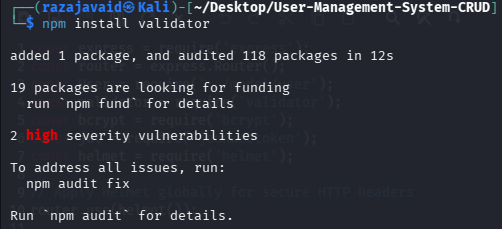

*Above: terminal output showing the `npm install validator` command completing successfully.*

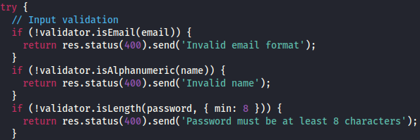

*Code snippet from the signup route where input is checked using validator methods.*

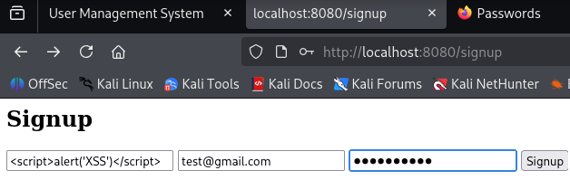

*The user registration form accepts properly formatted data.*

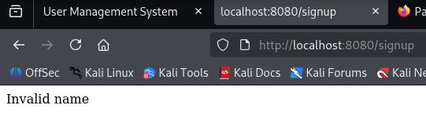

*Application returns an error message when the name field contains invalid characters or a script payload.*

**Impact**  
Rejects malformed or malicious payloads before they reach the database, eliminating the stored‑XSS vector described in Week 1.

---

### 2.2 Password Hashing
**Implementation**  
`bcrypt` was introduced during user registration to hash passwords.  The hashing occurs prior to saving the document; the raw password is never stored.

```javascript
const bcrypt = require('bcrypt');

const hashedPassword = await bcrypt.hash(password, 10);
const user = new User({ name, email, password: hashedPassword });
await user.save();
```

**Proof of Concept**

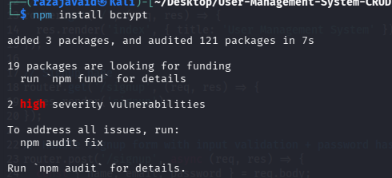

*Terminal log confirming `npm install bcrypt` was executed.*


*Server-side code that hashes the password before creating the user document.*

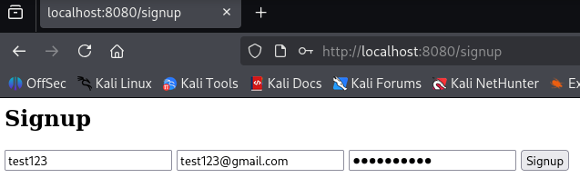

*Browser screenshot showing a completed registration form.*

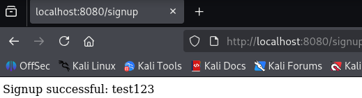

*Page indicating account creation; password is not displayed.*

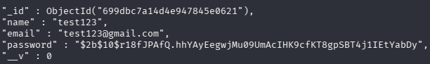

*MongoDB shell output displaying the stored hashed password instead of plaintext.*

**Impact**  
Mitigates credential exposure if the database is leaked; hashes are computationally expensive to reverse.

---

### 2.3 Token‑Based Authentication
**Implementation**  
Replaced the previous sessionless login with JWT tokens using `jsonwebtoken`.  Tokens are signed with a secret and expire after one hour.

```javascript
const jwt = require('jsonwebtoken');

const token = jwt.sign({ id: user._id }, 'your-secret-key', { expiresIn: '1h' });
res.send({ message: 'Login successful', token });
```

**Proof of Concept**

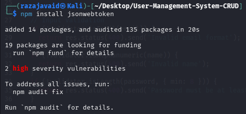

*Installation output for the `jsonwebtoken` package.*

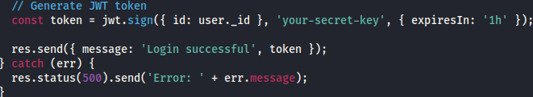

*Server code that signs and returns a JWT after successful authentication.*

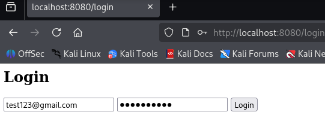

*Browser view of the login page with valid credentials filled in.*

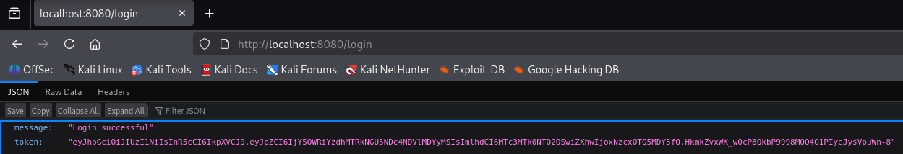

*HTTP response showing the issued token and success message.*

**Impact**  
Enables stateless authentication, avoids storing credentials on the client and reduces session hijacking risk.

---

### 2.4 HTTP Security Headers
**Implementation**  
The `helmet` middleware was applied at the router level to inject several security headers by default, including `X-Frame-Options`, `X-Content-Type-Options` and `Strict-Transport-Security`.

```javascript
const helmet = require('helmet');
router.use(helmet());
```

**Proof of Concept**

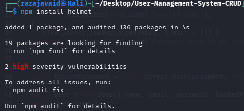

*Terminal confirming `npm install helmet`.*

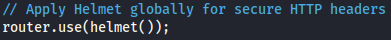

*Code snippet where the `helmet()` middleware is attached to the router.*

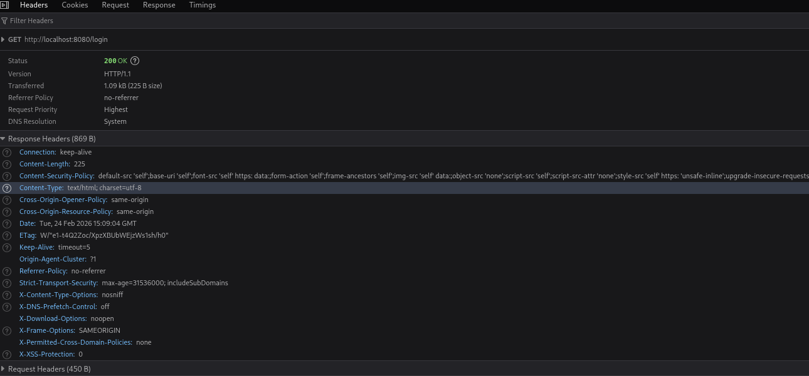

*Browser developer tools network panel listing the new headers (X-Frame-Options, X-Content-Type-Options, etc.).*

**Impact**  
Provides defense‑in‑depth against clickjacking, MIME confusion and other header‑based attacks.

---

## 3. Remediation Summary

| Area                         | Library / Tool      | Key Change                          | Screenshot(s)                                                                 |
|-----------------------------|---------------------|-------------------------------------|-------------------------------------------------------------------------------|
| Input validation            | validator           | Added format checks and sanitisation| validator_install, validator_code, validator_signup, validator_error         |
| Password storage            | bcrypt              | Hash before save                    | bcrypt_install, bcrypt_code, bcrypt_browser1/2, bcrypt_mongo                |
| Authentication              | jsonwebtoken        | JWT tokens with 1‑h expiry          | jwt_install, jwt_code, jwt_browser, jwt_token                               |
| HTTP headers                | helmet              | Applied secure headers globally     | helmet_install, helmet_code, helmet_headers                                 |

---

## 4. References

- [validator npm package](https://www.npmjs.com/package/validator)  
- [bcrypt documentation](https://www.npmjs.com/package/bcrypt)  
- [JSON Web Tokens (jwt.io)](https://jwt.io/)  
- [Helmet.js middleware](https://helmetjs.github.io/)  
- OWASP Top 10 – 2021  
- OWASP XSS Prevention Cheat Sheet  
- Node.js Security Checklist

---

## 5. Conclusion

All high‑severity vulnerabilities identified in Week 1 have now been remediated. The application enforces proper input validation, stores passwords securely, uses stateless token authentication, and sets recommended HTTP headers.  Week 3 will focus on automated validation tests, implementing CSP, enforcing HTTPS, and verifying the fixes. Continual monitoring and security testing remain essential as development progresses.

