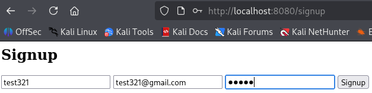
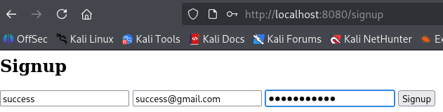
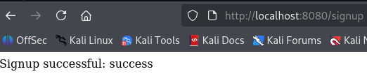
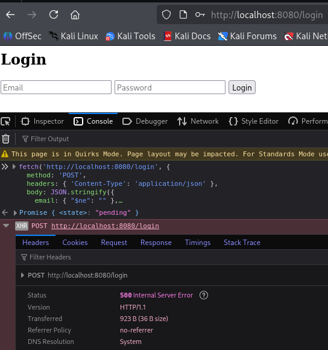
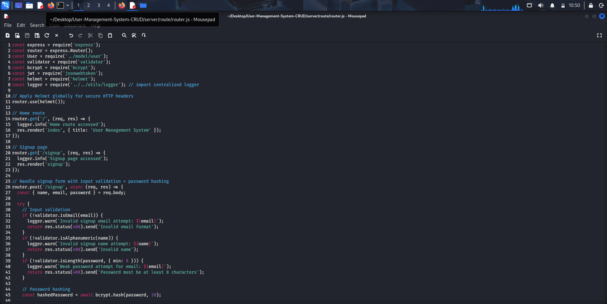
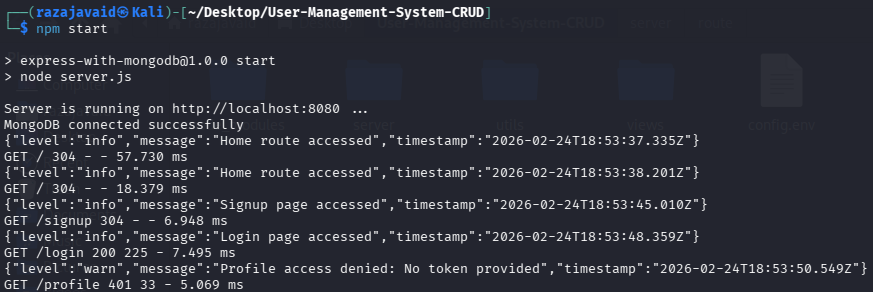
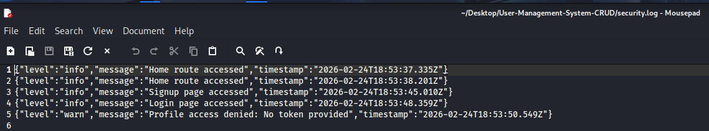
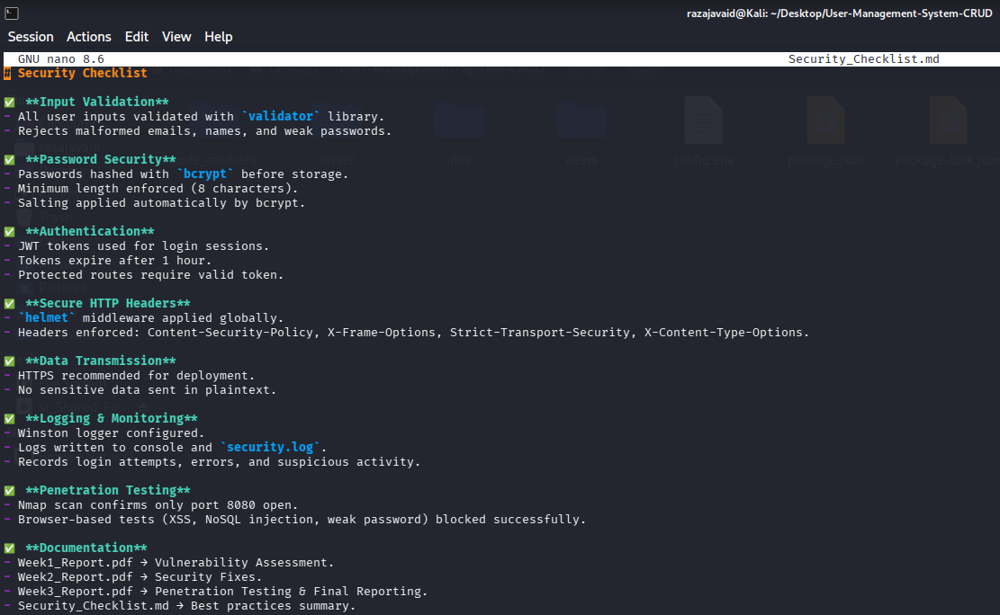

# Week 3 Report – Advanced Security & Final Reporting

**Application:** User Management System (Express + MongoDB)
**Prepared by:** Muhammad Raza
**Date:** February 25, 2026

---

## 1. Executive Summary

In Week 3 the team concentrated on advanced validation, penetration testing,
logging/monitoring and final documentation.  Key deliverables included:

- Penetration testing (network and browser‑based).
- Winston logging integration.
- Security checklist and repository clean‑up.
- Formal reports and evidence packaging.

| Area          | Outcome                                                    |
| ------------- | ---------------------------------------------------------- |
| Network scan  | Nmap confirmed only port 8080 open; Helmet headers present |
| Browser tests | XSS & NoSQL injection blocked; password policy enforced    |
| Logging       | Requests & errors recorded in `security.log`             |
| Documentation | Checklist and three reports completed                      |

---

## 2. Penetration Testing

### 2.1 Nmap Scan

- Port **8080** open serving the application.
- Headers detected: `Content-Security-Policy`, `Strict-Transport-Security`,
  `X-Frame-Options`, etc.
- Confirms Helmet middleware is active and only the intended service is
  exposed.

### 2.2 Browser‑Based Testing

The screenshots are now displayed inline with descriptions to improve readability:

- **XSS payload injection**The input field containing `` was rejected, so
  no script execution occurred.
- **Invalid name characters**Submitting a name with prohibited symbols produced an *Invalid name* error.
- **Weak credentials displayed**The browser warned that the supplied password was weak.
- **Short password submission**Trying to register with `12345` triggered the message *Password must be at
  least 8 characters*.
- **Correct signup form**The form populated as expected with valid values.
- **Successful signup**The confirmation displayed *Signup successful: success* after valid input.
- **NoSQL injection attempt in console**
  
  A crafted payload caused a 500 error, indicating the server rejects
  malformed query objects.

Each screenshot confirms that input validation, CSP, and sanitisation
defend against common browser‑based attacks.

---

## 3. Logging & Monitoring

- Winston added to `router.js` with log levels for routes, signup/login and
  errors.

- Terminal output showing messages such as *Home route accessed* and
  *Profile access denied: No token provided*.

- `security.log` stores structured JSON events with timestamps, levels
  (`info`, `warn`) and descriptive messages.
- Provides an audit trail for suspicious activity.

---

## 4. Security Checklist

The markdown checklist covers:

- Input validation & output encoding
- Password hashing & strength rules
- Authentication & authorization
- Secure headers (Helmet) and HTTPS
- Logging & monitoring
- Penetration testing procedures
- Documentation & reporting

A table of the main checklist items is included in the `Security_Checklist.md`
file.

---

## 5. Final Submission

Deliverables prepared for review:

| Item               | Location / Description                           |
| ------------------ | ------------------------------------------------ |
| GitHub repository  | Complete source, configs, and README files       |
| Week 1 report     | `Week1_Report.pdf` – vulnerability assessment |
| Week 2 report     | `Week2_Report.pdf` – security fixes           |
| Week 3 report     | `Week3_Report.pdf` – this document            |
| Security checklist | `Security_Checklist.md`                        |
| Screenshots        | `docs/screenshots` folder embedded in reports  |

---

## 6. Conclusion

Week 3 activities validated that the security measures implemented in
Week 2 are effective:

- Penetration testing showed resilience against XSS, NoSQL injection and weak
  passwords.
- Logging delivered visibility into application behaviour and potential
  abuse.
- Documentation artefacts (checklist and reports) complete the project
  lifecycle: **Identify → Fix → Validate → Document**.

---

## 7. References

- [Nmap Network Scanner](https://nmap.org/)
- [Winston Logging Library](https://github.com/winstonjs/winston)
- [OWASP Top 10 – 2021](https://owasp.org/Top10/)
- [OWASP XSS Prevention Cheat Sheet](https://cheatsheetseries.owasp.org/cheatsheets/Cross_Site_Scripting_Prevention_Cheat_Sheet.html)
- [Node.js Security Checklist](https://blog.risingstack.com/node-js-security-checklist/)
- [Helmet.js Security](https://helmetjs.github.io/)
- [Security checklist template](https://example.com/security-checklist)

*Additional resources documented in the `Security_Checklist.md` file.*
