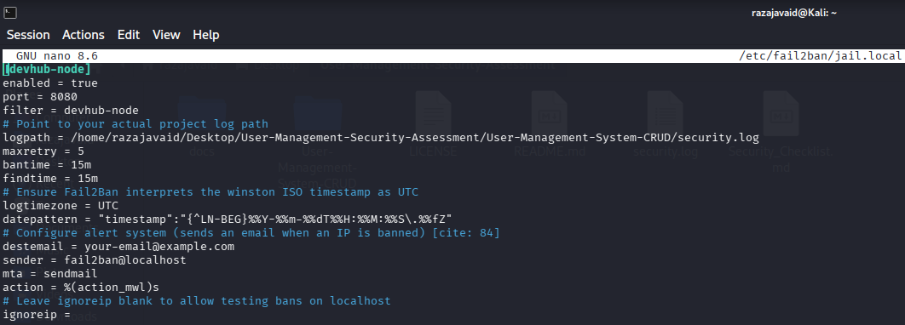
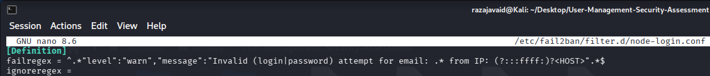
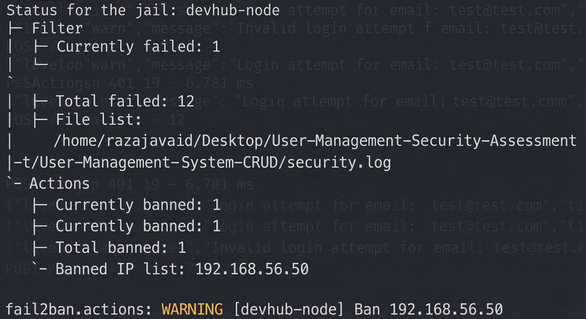
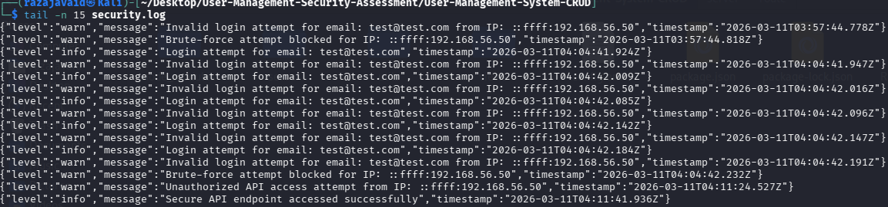
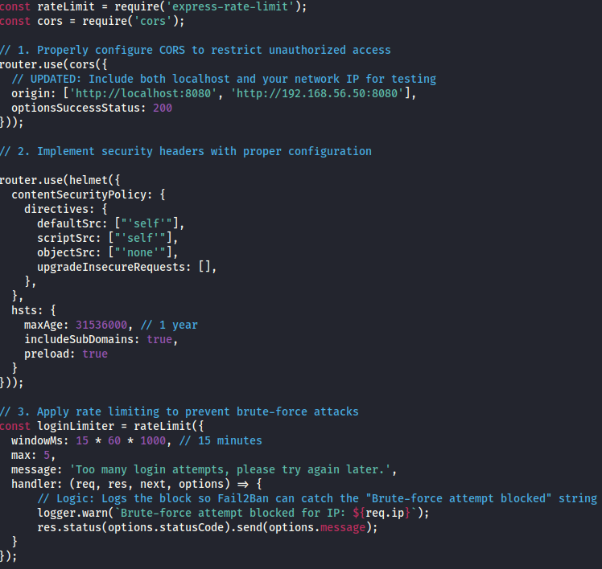
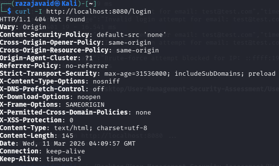
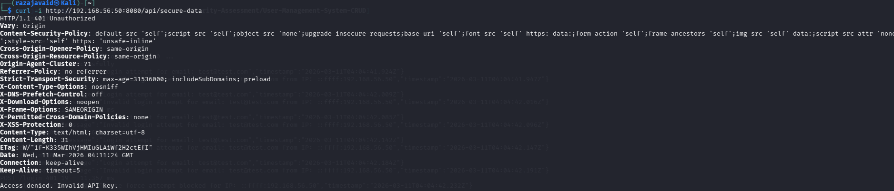
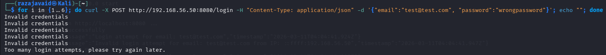

# Week 4 Security Assessment Report

**Application:** User Management System (Express + MongoDB)
**Prepared by:** Muhammad Raza
**Date:** 11 March 2026

---

## 1. Executive Summary

This week focused on implementing and validating intrusion detection and prevention for the User Management System. The team integrated Fail2Ban with Winston logging and applied API hardening techniques to detect, log, and mitigate brute-force and unauthorized access attempts. This report details the technical implementation, evidence, and security impact, with all screenshots linked and described inline.

---

## 2. Methodology

- **Fail2Ban Integration:** Custom jail and filter for Node.js login attempts, monitoring Winston log output.
- **Winston Logging:** Captured all authentication and security events for audit and response.
- **API Hardening:** Applied CORS, Helmet, and rate limiting to all endpoints.
- **Validation:** Manual endpoint testing and log review.

---

## 3. Implementation & Evidence

### 3.1 Fail2Ban Jail & Filter

To detect brute-force login attempts, a custom Fail2Ban jail was created to monitor the Winston-generated log file for failed logins.

**Fail2Ban jail configuration:**

**Fail2Ban filter regex:**

When repeated failed logins were detected, Fail2Ban automatically banned the offending IP address. The status output below shows 12 failed attempts and the currently banned IP:

### 3.2 Security Logging

Winston logging was configured to capture all security events, including:
- Invalid login attempts
- Brute-force attempts blocked
- Unauthorized API access
- Successful secure API endpoint access

**Security log evidence:**

### 3.3 API Hardening

The following security measures were implemented:
- **CORS restrictions** to limit allowed origins
- **Helmet middleware** for security headers
- **Rate limiting** to block brute-force attempts and log them for Fail2Ban

**API hardening code:**

---

## 4. Endpoint Testing & Results

Manual testing was performed to validate protections:

- **Incorrect login endpoint access** returned `404 Not Found`:
  

- **Unauthorized API access** to `/api/secure-data` returned `401 Unauthorized`:
  

- **Brute-force attempts** triggered rate limiting and Fail2Ban ban:
  

---

## 5. Impact & Security Analysis

- **Real-time detection and response:** Fail2Ban and Winston logging provided immediate visibility and automated blocking of brute-force attacks.
- **Audit trail:** Security logs offer a clear record of all suspicious and legitimate activity.
- **API resilience:** CORS, Helmet, and rate limiting significantly reduced the attack surface and mitigated common web threats.

---

## 6. References

- [Fail2Ban Documentation](https://www.fail2ban.org/wiki/index.php/Main_Page)
- [Winston Logger](https://github.com/winstonjs/winston)
- [Helmet.js Security](https://helmetjs.github.io/)
- [OWASP API Security Top 10](https://owasp.org/API-Security/)

---

## 7. Conclusion

By the end of Week 4:
- Fail2Ban and Winston logging were integrated for real-time detection and response.
- Custom jail and filter successfully detected and banned brute-force attempts.
- Security logs provided clear evidence of attacks and mitigations.
- API endpoints were hardened with CORS, Helmet, and rate limiting.

This demonstrates a complete defensive workflow:
**Detect → Log → Ban → Harden**

