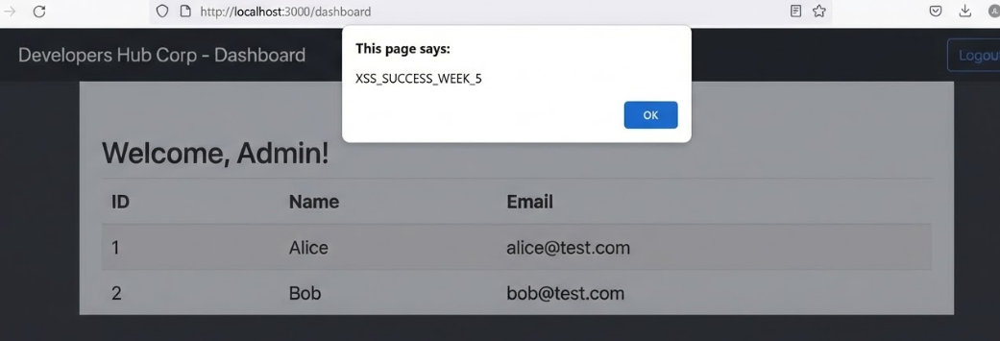
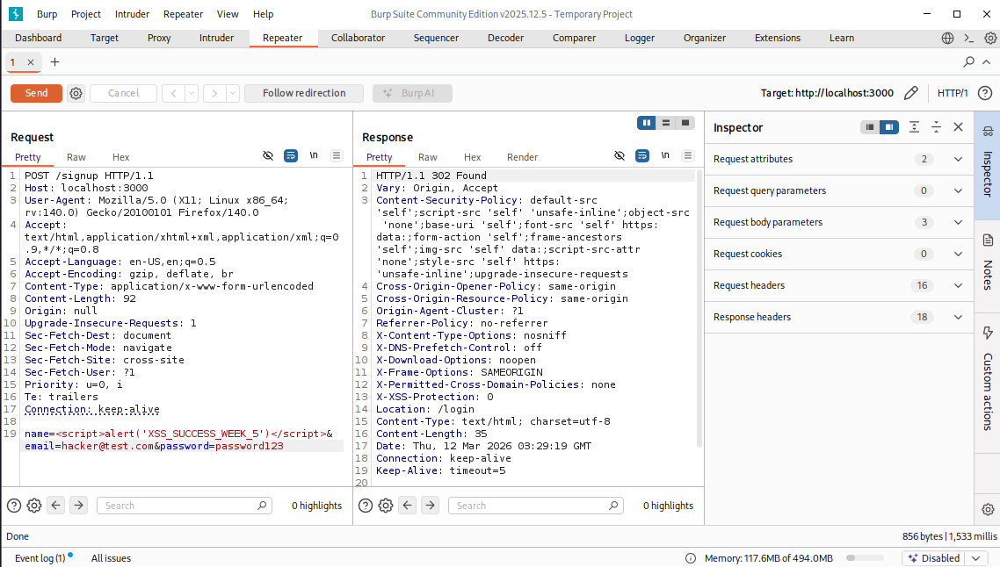
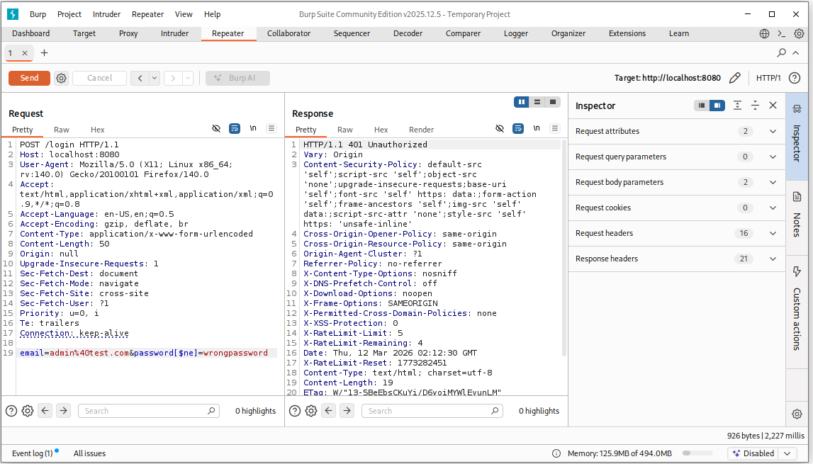
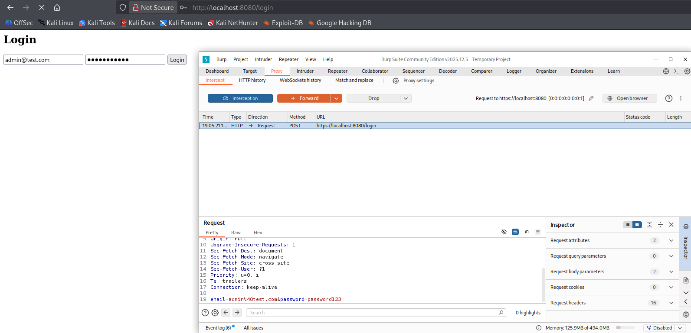
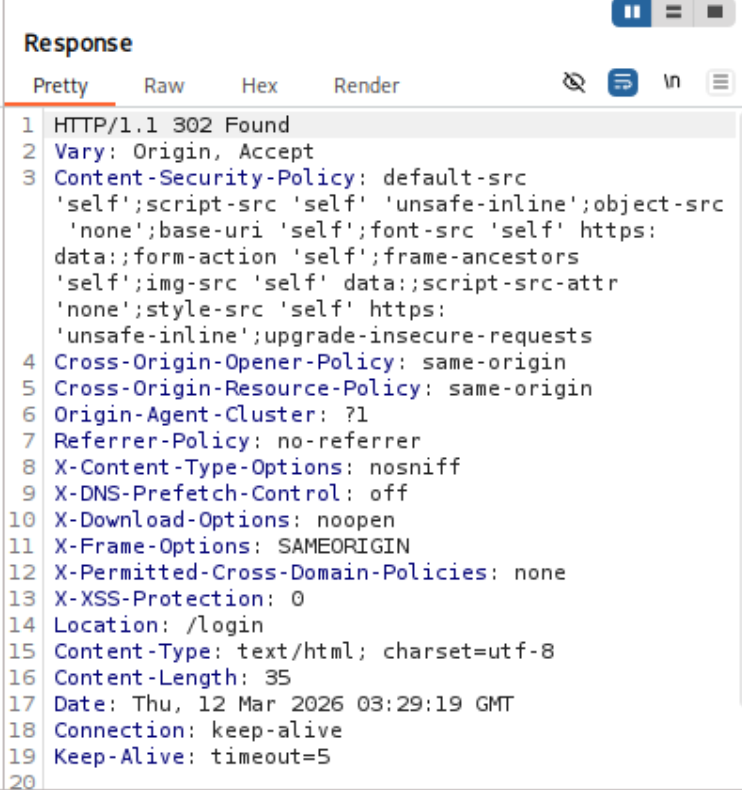

# Week 5 Security Assessment Report

**Application:** User Management System (Express + MongoDB)
**Prepared by:** Muhammad Raza
**Date:** 12 March 2026

---

## 1. Executive Summary

This week focused on identifying and remediating critical vulnerabilities: Stored Cross-Site Scripting (XSS), NoSQL Injection, and Content Security Policy (CSP) weaknesses. The team performed root cause analysis, implemented fixes, and validated them with evidence and impact analysis. All screenshots are linked and described inline.

---

## 2. Methodology

- Manual penetration testing (browser and API)
- Code review for input validation and query logic
- Use of Burp Suite for injection and header analysis
- Review of server logs and browser responses

---

## 3. Detailed Findings & Remediation

### 3.1 Stored XSS Vulnerability

The application rendered user input directly into HTML using `<%- name %>` in EJS templates, allowing malicious scripts to execute.

**Proof of Concept:**

1. XSS payload injected via signup form:
   
2. Burp Suite request showing payload:
   

**Impact:**

- Attackers could execute arbitrary JavaScript in user browsers, leading to session hijacking and data theft.

**Remediation:**

- Output encoding: Replaced `<%- name %>` with `<%= name %>` in EJS templates.
- Sanitization: Used `dompurify` to strip `<script>` tags before saving to MongoDB.
- CSP Hardening: Removed `'unsafe-inline'` from CSP in production.

---

### 3.2 NoSQL Injection Vulnerability

The server accepted objects in login fields (e.g., `password[$ne]=wrongpassword`), allowing attackers to bypass authentication logic.

**Proof of Concept:**

1. Burp Suite request with `$ne` operator:
   
2. Intercepted login request with raw credentials:
   

**Impact:**

- Attackers could log in as any user without valid credentials, risking full account compromise.

**Remediation:**

- Sanitization: Used `mongo-sanitize` to strip keys starting with `$` from all user input.
- Validation: Enforced strict input types with `express-validator`.
- Hardened authentication queries to only accept sanitized strings.

---

### 3.3 Content Security Policy (CSP) Weakness

During testing, `'unsafe-inline'` was added to CSP to allow injected scripts, weakening browser protections.

**Proof of Concept:**

1. Burp Suite response headers showing CSP with `'unsafe-inline'`:
   

**Impact:**

- Allowed execution of inline scripts, increasing XSS risk.

**Remediation:**

- Strict CSP: Removed `'unsafe-inline'` in production.
- Allowed only trusted sources for scripts, styles, and objects.

---

## 4. Validation & Impact

- Manual retesting confirmed XSS and NoSQL injection vectors were blocked.
- Browser DevTools showed strict CSP headers in all responses.
- Security logs showed no further evidence of successful attacks.

---

## 5. References

- [OWASP XSS Prevention Cheat Sheet](https://cheatsheetseries.owasp.org/cheatsheets/Cross_Site_Scripting_Prevention_Cheat_Sheet.html)
- [OWASP NoSQL Injection](https://owasp.org/www-community/attacks/NoSQL_Injection)
- [Helmet.js Security](https://helmetjs.github.io/)

---

## 6. Conclusion

By the end of Week 5:

- Stored XSS was mitigated with output encoding, sanitization, and strict CSP.
- NoSQL Injection was prevented with input sanitization and validation.
- CSP was hardened to block inline scripts and enforce secure defaults.

These fixes significantly improve the application’s resilience against common web attacks and align with industry best practices for secure development.
