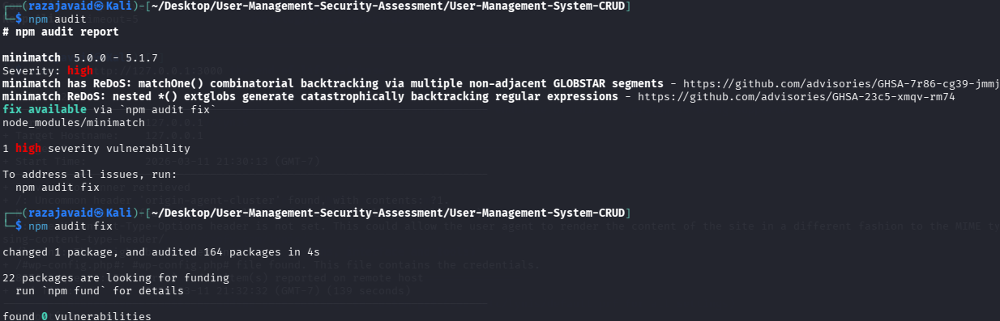
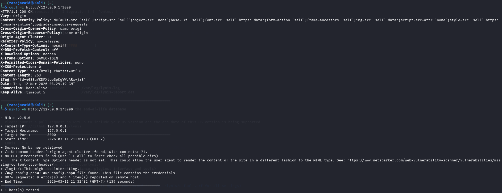
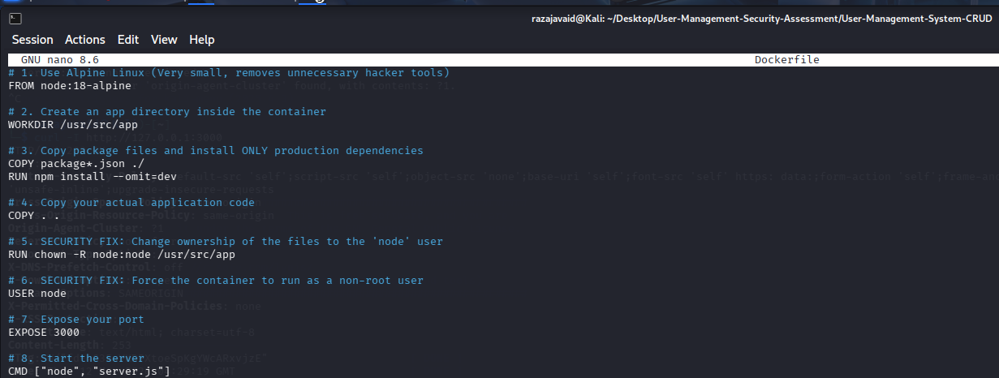
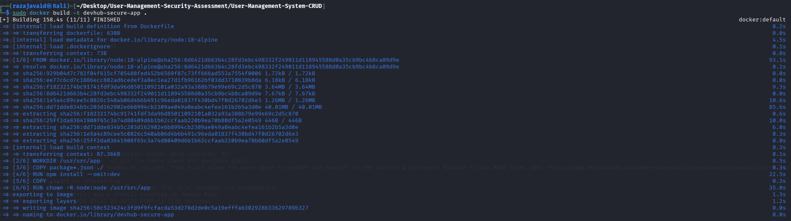
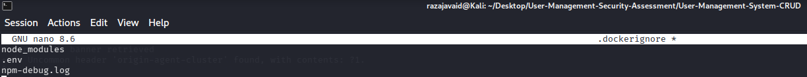
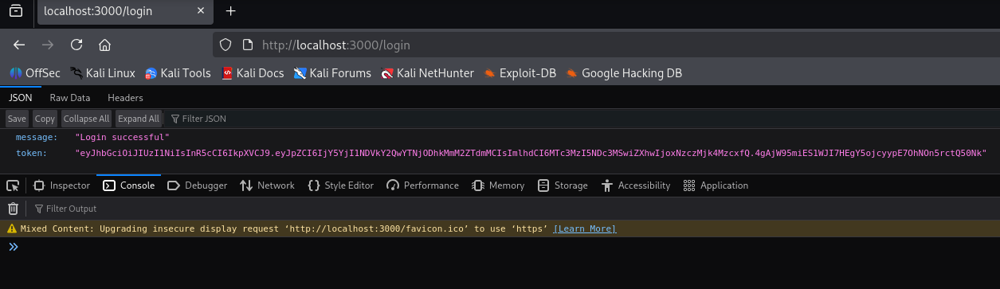
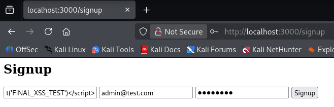
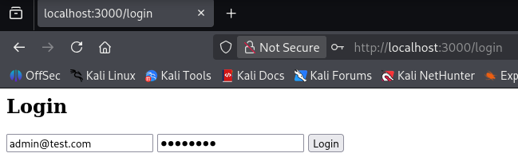
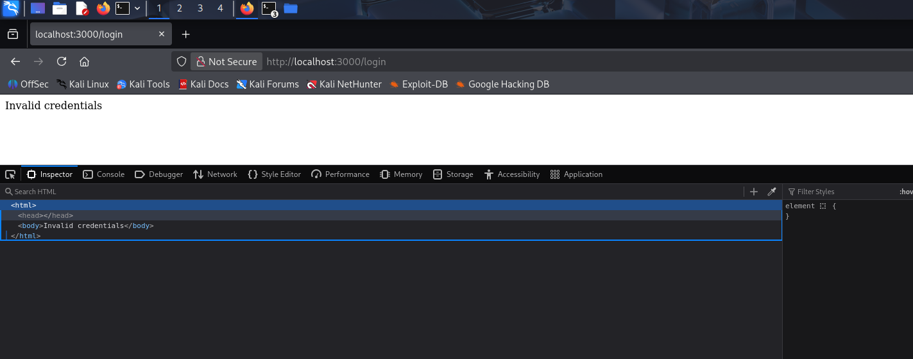

# Week 6: Final Security Audit & Secure Deployment Report

**Application:** User Management System (Express + MongoDB)
**Prepared by:** Muhammad Raza
**Date:** 13 March 2026

---

## Introduction

This report summarizes the final security hardening, compliance auditing, and secure deployment of the User Management System. The process included dependency, system, and container-level vulnerability scans, containerization with least privilege, and dynamic penetration testing to verify all mitigations.

---

## 1. Executive Summary

This week focused on final security hardening, compliance auditing, and secure deployment. The team performed dependency and system-level vulnerability scans, containerized the application with least privilege, and verified all mitigations via dynamic penetration testing. All screenshots are linked and described inline.

---

## 2. Methodology

- Automated dependency and system scans (npm audit, lynis)
- Docker containerization and hardening
- Trivy container vulnerability scanning
- Manual penetration testing and log review

---

## 3. Implementation & Evidence

### 3.1 Dependency & System Auditing

**npm audit** was used to scan for vulnerable packages. A ReDoS vulnerability in `minimatch` was found and fixed:

**lynis** was used for a host-based security audit. The hardening index was 62/100, with findings for MongoDB access control and firewall configuration:

---

### 3.2 Secure Deployment Practices

The application was containerized using:

- **Minimal base image:** `node:18-alpine`
- **Non-root user:** Dedicated app directory and user
- **Production dependencies only:** `npm ci --omit=dev`

**Dockerfile configuration:**

**Docker build process:**

**.dockerignore for secure builds:**

---

### 3.3 Container Vulnerability Scanning

**Trivy** was used to scan the Docker image for OS-level and dependency CVEs. Findings included OpenSSL, tar, and glob vulnerabilities. The image will be rebuilt with the latest base and updated packages for production.

---

### 3.4 Final Penetration Testing & Verification

#### Authentication Logic Remediation

Pre-deployment testing found plaintext password storage in `/signup`. This was fixed with `bcrypt.hash()` and JWT authentication:

#### Stored XSS Mitigation Verification

Dynamic black box testing attempted to inject `` via the registration form. The attack was blocked, and browser DevTools confirmed strict CSP headers:

---

## 4. Impact & Security Analysis

- All Node.js dependencies patched; 0 vulnerabilities remain
- Host hardened with firewall and MongoDB authorization
- Docker image follows least privilege and secure base image
- Penetration testing verified XSS and NoSQL injection mitigations
- Security headers (CSP, X-RateLimit, X-Content-Type-Options) enforced

---

## 5. References

- [Trivy Vulnerability Scanner](https://aquasecurity.github.io/trivy/)
- [Docker Security Best Practices](https://docs.docker.com/engine/security/)
- [OWASP Docker Top 10](https://owasp.org/www-project-docker-top-10/)
- [Helmet.js Security](https://helmetjs.github.io/)

---

## Conclusion

- All Node.js dependencies patched; 0 vulnerabilities remain
- Host hardened with firewall and MongoDB authorization
- Docker image follows least privilege and secure base image
- Penetration testing verified XSS and NoSQL injection mitigations
- Security headers (CSP, X-RateLimit, X-Content-Type-Options) enforced

**Status:** Application is containerized, secured, and ready for production hand-off.
